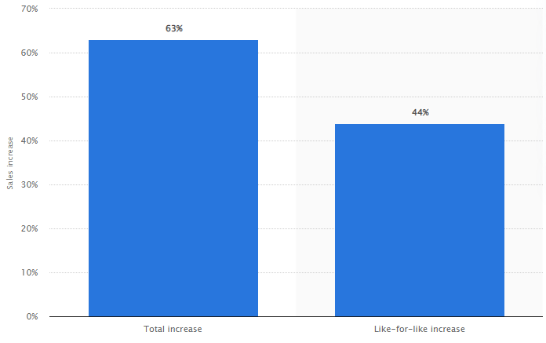

# 1.1 Problem Identification

### Why do a video game?

Over the past few years Covid-19 has forced many into self isolation, this has led people to the worst place on the internet, gaming. Due to the pandemic, games companies have reported a 63% total increase in videogame sales, 4.3 million copies of games sold on the market ([J. Clement, 2021a](../reference-list.md)), this does not even take into account the amount of free to play games or games that people came back to due to having a surplus of free time. Near 1 million concurrent players play popular shooter game Apex Legends across all platforms in 2022 this shows that during the pandemic people found other ways to be social and have become more Lenient towards videogames as a whole. &#x20;

With this many people online at home ([J. Clement, 2021b](../reference-list.md)) videogames provided young people with immersive and compelling social, cognitive, and emotional experiences especially during times wherein they could not access these social situations due to the pandemic. Furthermore, these experiences may have had the potential to enhance mental health and well-being in children and adolescents. ([Pallavicini, Ferrari and Mantovani, 2018](../reference-list.md))

Not all games have to be social however, many single player games provide cognitive benefits such as deepening neural pathways in the brain by providing challenging puzzles that open the brain to further learning ([Nanyang Technological University, 2014](../reference-list.md))

Videogames overall provide a high emotional reward, especially fighting games. However, more casual games (puzzle games) are relaxing to a wider variety of people (Limelight Networks, 2019)

Porter, A.M. and Goolkasian, P. (2019). Video Games and Stress: How Stress Appraisals and Game Content Affect Cardiovascular and Emotion Outcomes. Frontiers in Psychology, \[online] 10(30464753). Available at: [https://www.ncbi.nlm.nih.gov/pmc/articles/PMC6524699/](https://www.ncbi.nlm.nih.gov/pmc/articles/PMC6524699/) \[Accessed 18 Mar. 2022].

