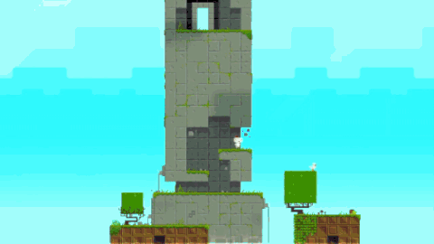

# 1.4 Features of Proposed Solution

## Mechanics

### Movement

Movement in a 3D space is inherently harder than movement in a 2D space due to there being an extra dimension but my character will only move in any two directions at once based on where the camera is viewing them from. This can be done by giving the character linear acceleration; which is better than instant movement as it gives more options to the player for movement as the character will first be slower as it speeds up to normal speed, however when it decelerates it should stop instantly to prevent the player from sliding off of edges that are unintended and frustrating. There should be a physics engine that allows the player to jump like in FEZ, the longer you hold the higher you should jump for even more variation.

### Collisions

Collision detection in games are essential as it allows the program to take action on those collisions, like standing on a platform, taking damage from an obstacle or enemy or activating a teleporter.

### Controls

Controls are essential for the player to be able to actually play the game, My controls will have to be simple and easy to pick up, unlike fez which has a lot of keybinds without much use for each as it is a port from consoles - my game will be a webapp and will use WASD for its 2D controls and Q & E for controlling the camera rotation with ENTER being used for interact and ESC to pause the game.&#x20;

## Level Design and Layout

Levels in my game will consist of a 3D space viewed from 4 angles, each of which can be played as a 2D platformer an orthographic camera will be used as it removes perspective and allows the player to understand where they are.

### Four-point Orthographic Camera View

The Four-Point camera view makes the player think about their next move around the level, it hides the next jump/ move through clever level design and forces the player to look at platforming from a new perspective, this camera also follows the player loosely to not show the entire level, this is done to show a sense of scale.

### Puzzles

Puzzles will consist of rotating the camera around the level and understanding where you need to go by positioning the platforms into jumpable range with the camera and jumping through portals and collecting objectives to open a door to the next level.

### Obstacles

In the level there should be obstacles that impede the players progress, these could be solved by using the rotating camera, as an example there could be a platform too high to reach but by rotating the camera it reveals that there is another that leads to it that was not obvious beforehand. There could also be activatable teleporters to traverse the level.

## Graphics and UI (user interface)

### Design

.png>)

I will be using the pixel art style in my game, this allows me to easily create textures to apply to my 3D assets, it also makes the game easily approachable and brighter colours could highlight key points and interactable objects which will make the game widely accessible.

### User Interface

.png>)

The user interface will make it easy for the player to understand what is going on. Within the levels, the UI will clearly let the user know what is going on. It will let them know how many items they have collected, show how much health they have and let them know how many cubes are left order to complete the level.

### Saving System

Saving is a key feature to include in a game as it allows a player to pick up where they left off. It is important as most often, people do not like to redo what they have done if there is a way for them to be able to do new levels. The saving system will save where they were so that when they come back to the game they can carry on from the level they stopped on. The player will also be given an option to restart their progress.&#x20;

## Limitation

### Platform Support

The game will be supported on PC as it will be built in a web browser and use WASD controls and a Mouse to click on menu buttons. This means other platforms will not be supported.

### Length of Gameplay

The length of gameplay would be nice if it were very long but I feel like it would take a long time to make a longer game, I think for a proof of concept, 3-5 levels would be enough.

### Performance

As I will be developing a a web based game, the game will be limited to the performance of the browser.

### Graphics and other Game Art

I could make a pixel art asset pack that I could use for the project.

## Justification for Computational methods

Computational thinking is about thinking about how a problem can be solved. The process can be described as formulating the problem in such a way so that it can be solved by creating an algorithm. Following the computational methods allow you to create an efficient and useful solution.

* Computational methods allow data to be saved and accessed very fast at any time, this is good due to that fact the player will be saving and loading the game.
* The user needs to interact with the world so computational methods are needed
