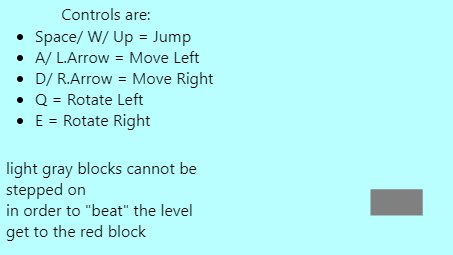

# 4.1 Evaluation of Success Criteria

### Criteria

| Criterion | Description                                                                                                                                                  | When was it achieved             |
| --------- | ------------------------------------------------------------------------------------------------------------------------------------------------------------ | -------------------------------- |
| 1         | The Levels should consist of floating platforms for the players to stand on from multiple angles and should clearly be safe to interact with for the player. | Cycle 5                          |
| 2         | There should be a decent amount of levels 3-4                                                                                                                | Cycle 12                         |
| 3         | The Levels include puzzles that are easy to begin with but get harder as you progress.                                                                       | Cycle 11                         |
| 4         | The puzzles should be set out in such a way that utilises learning the core mechanics of the game.                                                           | Cycle 8                          |
| 5         | In cooperate Obstacles into the levels                                                                                                                       | Cycle 10                         |
| 6         | Movement                                                                                                                                                     | Cycle 3                          |
| 7         | Collision detection                                                                                                                                          | Cycle 2                          |
| 8         | Camera Follows the player                                                                                                                                    | Cycle 3                          |
| 9         | When playing through the levels, the levels should take you back to the level select                                                                         | Cycle 8                          |
| 10        | Player should be able to see what items they have at all times                                                                                               | n/a                              |
| 11        | The player should be able to pause the game and access a menu with different settings.                                                                       | n/a                              |
| 12        | The player should be able to reset all progress on the game without redownloading it.                                                                        | The game does not save progress. |
| 13        | The game should run without crashing                                                                                                                         | Cycle 1                          |
| 14        | The game should not have choppy graphics                                                                                                                     | Cycle 12                         |
| 15        | Game should have a colour scheme with objects that are interactable being highlighted.                                                                       | Cycle 10                         |
| 16        | Each level should be unique                                                                                                                                  | Cycle 12                         |

### Criterion 1

<figure><figcaption></figcaption></figure>

The floors are floating and you can clearly stand on them from any angle

### Criterion 2

<figure><figcaption></figcaption></figure>

There are 3 different unique levels this meets the criterion that i set out the achieve.

### Criterion 3

<figure><figcaption></figcaption></figure>

<figure><figcaption></figcaption></figure>

<figure><figcaption></figcaption></figure>

The levels start off simple, each introducing a new mechanic - therefore keeping the difficulty hard and continuing the learning the process.

### Criterion 4

<figure><figcaption></figcaption></figure>

The levels require you to rotate the camera to progress through them

### Criterion 5

<figure><figcaption></figcaption></figure>

one of the obstacles is this blue button, without activating it you cannot finish the level.

### Criterion 6

<figure><figcaption></figcaption></figure>

these controls allow the character to move around the level&#x20;

### Criterion 7

<figure><figcaption></figcaption></figure>

The player is able to stand on the blocks, as evidenced by this screenshot and my slides

### Criterion 8

<figure><figcaption></figcaption></figure>

The camera moves when the character moves, and resets the the players position when they die, it  moves left and right but not up or down as i feel that would be too disorienting.

### Criterion 9

<figure><figcaption></figcaption></figure>

<figure><figcaption></figcaption></figure>

When you reach the red block in any level, it takes you back to the main menu

### Criterion 10

Feature not added

### Criterion 11

Feature not added

### Criterion 12

<figure><figcaption></figcaption></figure>

The game does not crash even if extensive keys are used, as it is quite graphically simple

### Criterion 13

Feature not added

### Criterion 14

The game isnt very graphically intensive so it runs really well, so it doesn't have any choppy graphics.

### Criterion 15

each object that you can interact with is highlighted in a different colour.

.png>)

button

.png>)

end block

.png>)

portals

### Criterion 16

Each level is unique, with a different layout / learning curve

